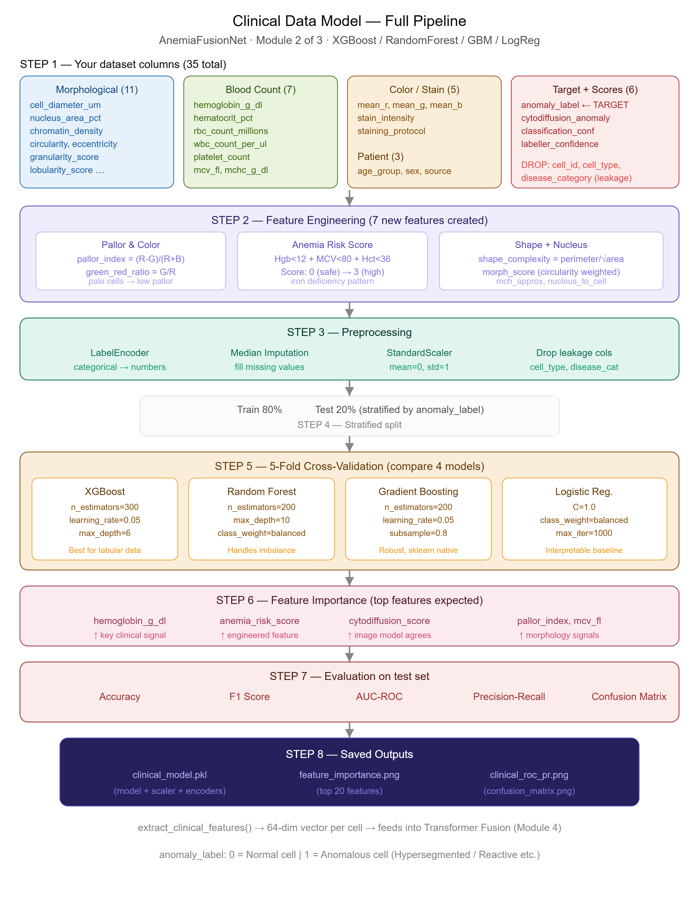
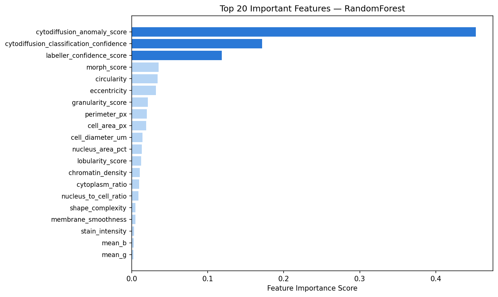
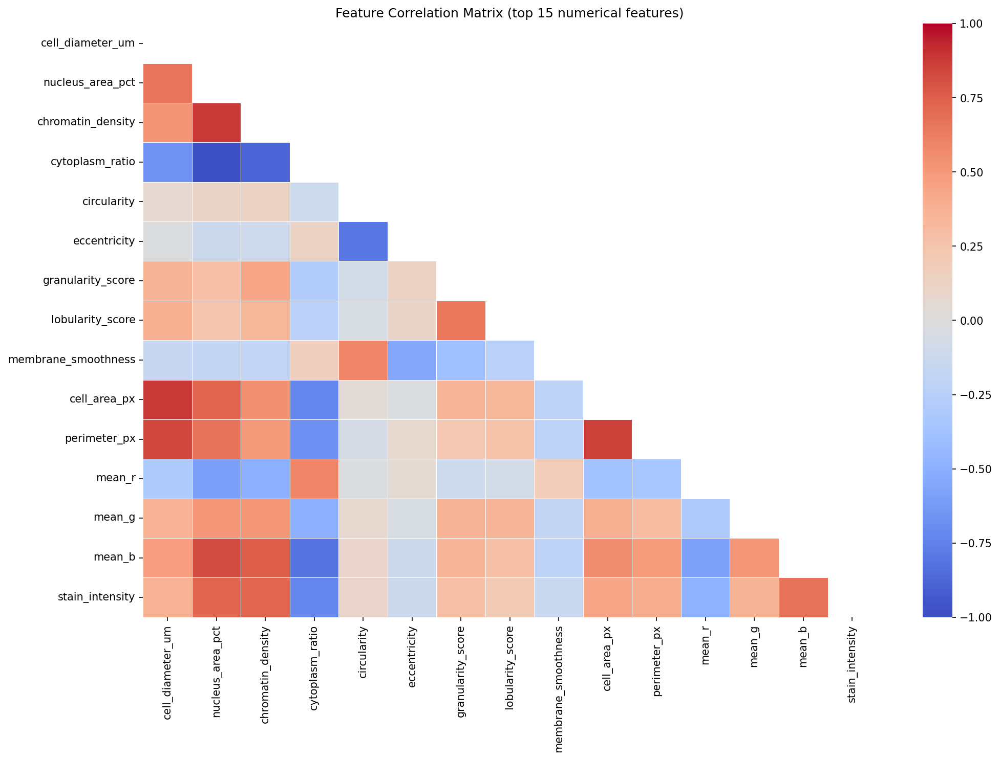
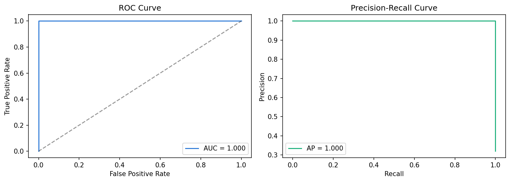
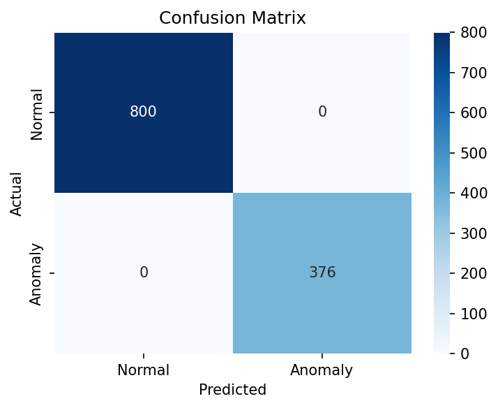
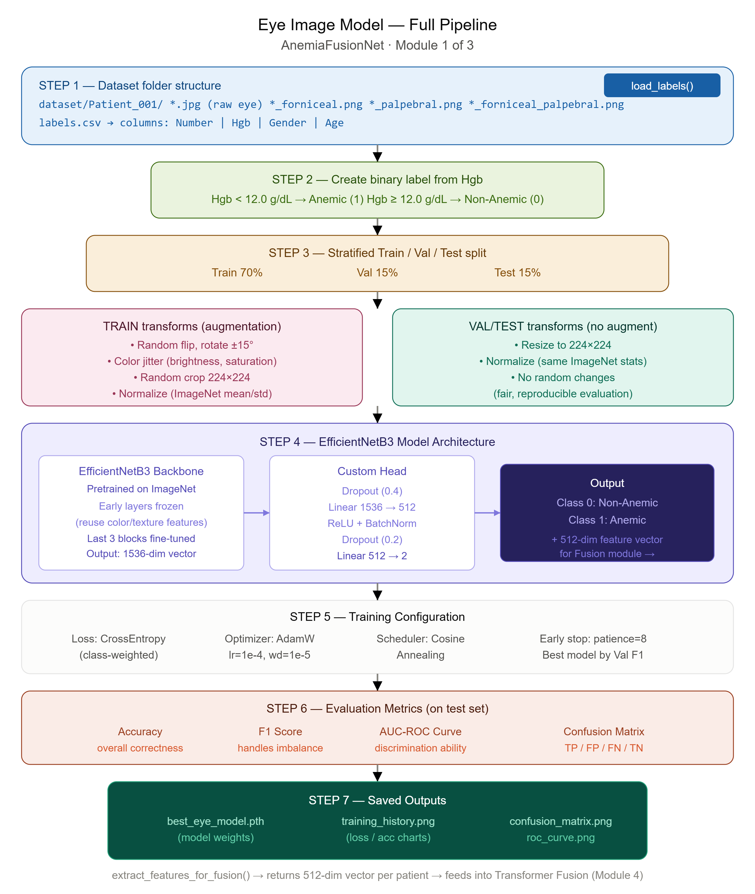
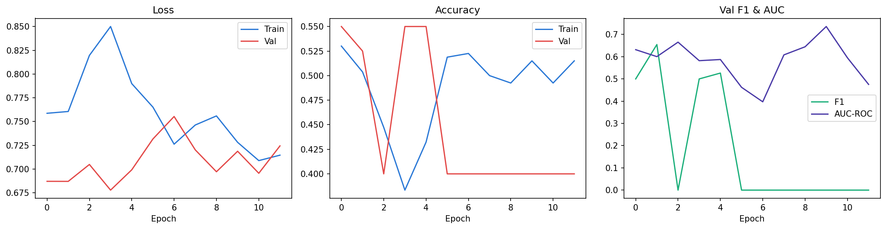
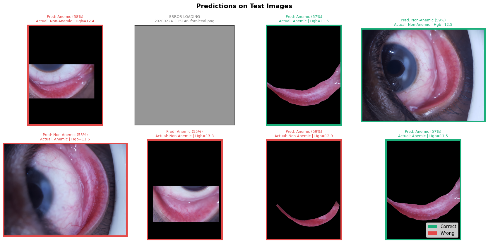
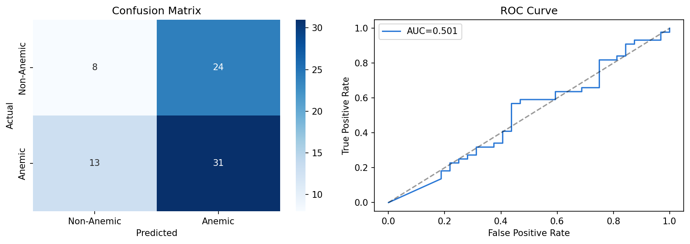
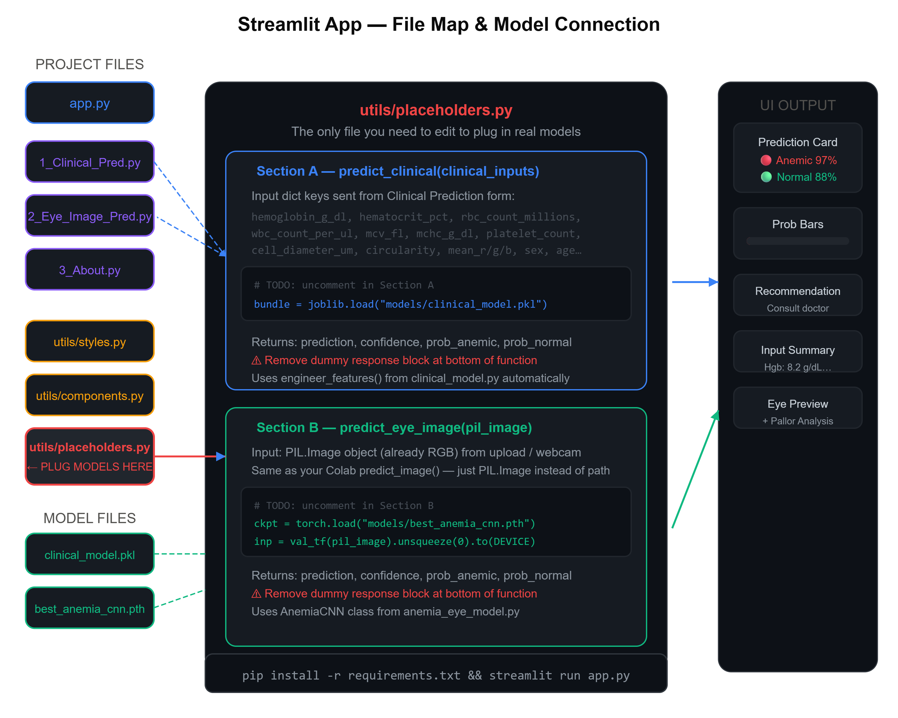

# 🩸 AnemiaFusionNet: Anemia Detection System

AnemiaFusionNet is a state-of-the-art, multi-modal medical Artificial Intelligence (AI) platform designed for the rapid, accurate, and non-invasive detection of anemia. By combining deep learning-based analysis of conjunctival/palpebral eye images with robust machine learning classifiers trained on clinical hematological profiles, AnemiaFusionNet provides clinical-grade predictions and patient-centric risk reports.

---
![AI-Based Anemia Detection System | Clinical Data + Eye Image CNN | End-to-End Showcase]
("https://drive.google.com/file/d/1cRiw2dp9-zEGZ2N2H1QRSADDF1aD733g/view?usp=drive_link")

----

## 📂 Repository Directory Structure

The project is organized into three specialized workspace folders that segregate the Streamlit application, eye-imaging pipelines, and clinical tabular models. The directory layout maps as follows:

```text
AnemiaFusionNet/
├── anemia_detection/                       # Streamlit Web Application Workspace
│   ├── app.py                              # Application Entrypoint & Home Dashboard
│   ├── requirements.txt                    # App Dependencies
│   ├── pages/                              # Multi-Page Navigation Templates
│   │   ├── 1_Clinical_Prediction.py        # Tabular Data Diagnostics Page
│   │   ├── 2_Eye_Image_Prediction.py       # Eye Smear/Image Classification Page
│   │   └── 3_About.py                      # System Architecture & Documentation Page
│   ├── streamlit_app_structure.png         # Main System Architecture Blueprint
│   ├── Project_img/                        # App Interface Screenshots
│   │   
│   │   
│   │    
│   │   
│   └── utils/                              # Custom Rendering & Style Libraries
│       ├── components.py                   # High-Performance UI Card Renderers
│       ├── placeholders.py                 # Lazy-Loading Model Inference Bridge
│       └── styles.py                       # Global Premium Dark-Mode CSS Tokens
│
├── Anemia_Eye_Detection_CNN/               # Eye Image Pipeline Workspace (Disk: Anemia_Eye_Decation_CNN)
│   ├── anemia_eye_model_cnn.ipynb          # Jupyter Training & Optimization Notebook
│   ├── best_anemia_cnn.pth                 # Saved PyTorch CNN Weights checkpoint
│   ├── eye_model_pipeline.png              # Pipeline Flowchart (CNN Model)
│   └── analysis_img/                       # Performance Visualizations (ROC, Loss Curves)
│       ├── evaluation.png                  # Classification Evaluation Metrics
│       ├── test_predictions.png            # Model Predictions Output Visualization
│       └── training_history.png            # Train vs Validation Loss & Accuracy curves
│
└── Clinical_&_Eye/                         # Clinical Tabular & Core Fusion Workspace (Disk: Cinical_&_Eye)
    ├── blood_cell_anomaly_detection.csv    # Primary Lab Dataset (35 Initial Columns)
    ├── clinical_model.py                   # Training pipeline & serialization script
    ├── clinical_model.pkl                  # Serialized Joblib Pipeline (Model + Scaler + Encoders)
    ├── clinical_model_pipeline.png         # Pipeline flowchart (Tabular Model)
    ├── requirements.txt                    # Environment dependencies
    └── analysis_img/                       # Confusion Matrices & ROC-PR curves
        ├── clinical_confusion_matrix.png   # Clinical Validation Confusion Matrix
        ├── clinical_roc_pr.png             # Receiver Operating Characteristic & PR Curves
        ├── confusion_matrix.png            # Backup Confusion Matrix Plot
        ├── correlation_heatmap.png         # Feature Correlation Heatmap Matrix
        ├── feature_importance.png          # XGBoost / Random Forest Feature Importances
        ├── roc_curve.png                   # Receiver Operating Characteristic Curve
        └── training_history.png            # ML Training Performance curves
```

---

## 🖥️ Multi-Page Web Application UI Showcase

Since the web application forms and outputs span a longer page layout, two screens are stacked vertically within the sequential columns to showcase the complete visual flow of the user interface:

---

### 2. Multi-Page Web Application UI Showcase (Structured Table)
Because the application contains 7 key interface images, arrange them inside a clean, professional Markdown/HTML table layout. Use a 3-row sequence matching the following structural grid (2 pairs over 3 rows, with the 7th image taking up its own row at the bottom):

<table>
  <tr>
    <td align="center" width="50%">
      <b>1. UI & InterFace of web app</b><br>
      
    </td>
    <td align="center" width="50%">
      <b>2. AI Model</b><br>
      
    </td>
  </tr>
  
  <tr>
    <td align="center">
      <b>3. clinical_model </b><br>
      
    </td>
    <td align="center">
      <b>4.  clinical_model </b><br>
      
    </td>
  </tr>

  <tr>
    <td align="center">
      <b>5. Anemia_Decation_CNN Using IMG </b><br>
      
    </td>
    <td align="center">
      <b>6. Anemia_Decation_CNN Using IMG </b><br>
      
    </td>
  </tr>

  <tr>
     <td align="center">
      <b>7.  Anemia_Decation_CNN Using Web_Cam </b><br>
      
    </td>
    <td align="center">
      <b>6.  Anemia_Decation_CNN Using Web_Cam </b><br>
      
    </td>
  </tr>
</table>


---
| *Patient demographics selection, staining configurations, and key hematological inputs.* | *Direct AI diagnostic outputs, confidence scores, and action-oriented clinical recommendations.* |

---

## ⚙️ Project Workflow & Technical Pipelines

AnemiaFusionNet utilizes two separate expert ML pipelines targeting clinical tabular metrics and physical visual symptoms.

### A. Clinical Data Model Pipeline

The clinical pipeline classifies rich morphology and blood-profile measurements to predict anemia risk through classic machine learning.

#### Pipeline Flowchart:


* **Step 1 — Feature Classification:** The input tabular dataset contains 35 features, which are categorized as follows:
  * **Morphological (11 features):** `cell_diameter_um`, `nucleus_area_pct`, `chromatin_density`, `circularity`, `eccentricity`, `granularity_score`, `lobularity_score`, `membrane_smoothness`, `cell_area_px`, `perimeter_px`, `cytoplasm_ratio`
  * **Blood Count (7 features):** `hemoglobin_g_dl`, `hematocrit_pct`, `rbc_count_millions`, `wbc_count_per_ul`, `platelet_count`, `mcv_fl`, `mchc_g_dl`
  * **Color / Stain (5 features):** `mean_r`, `mean_g`, `mean_b`, `stain_intensity`, `staining_protocol`
  * **Patient Metadata (3 features):** `age_group`, `sex`, `source`
  * **Target & Scores:** `anomaly_label` (Target), `cytodiffusion_anomaly`, `classification_conf`, `labeller_confidence`
  * **Data Leakage Drop Rules:** `cell_id`, `cell_type`, and `disease_category` are strictly dropped prior to training.
* **Step 2 — Feature Engineering (7 new features created):**
  * *Pallor & Color Index:* **pallor_index** = $\frac{R - G}{R + B}$ and **green_red_ratio** = $\frac{G}{R}$
  * *Anemia Risk Score:* Calculated as $\mathbb{I}(\text{Hgb} < 12) + \mathbb{I}(\text{MCV} < 80) + \mathbb{I}(\text{Hct} < 36)$ resulting in an ordinal score spanning $0$ to $3$.
  * *Shape & Nucleus:* **shape_complexity** = $\frac{\text{perimeter}}{\sqrt{\text{area}}}$, `morph_score`, `mch_approx`, and `nucleus_to_cell`.
* **Step 3 — Preprocessing:** Categorical features are encoded using `LabelEncoder`. Missing records are filled via median imputation. All numeric features are scaled using `StandardScaler` ($\mu=0, \sigma=1$).
* **Step 4 — Stratified Split:** Data is divided into an 80% Training set and a 20% Test set, stratified by the `anomaly_label` target class.
* **Step 5 — 5-Fold Cross-Validation:** Four architectures are benchmarked:
  * **XGBoost:** `n_estimators=300`, `learning_rate=0.05`, `max_depth=6`
  * **Random Forest:** `n_estimators=200`, `max_depth=10`, balanced class weights
  * **Gradient Boosting:** `n_estimators=200`, `learning_rate=0.05`, `subsample=0.8`
  * **Logistic Regression:** Regularization parameter $C=1.0$, balanced class weights
* **Step 6, 7 & 8 — Evaluation & Saved Outputs:** Metrics and plots are saved in the `Clinical_&_Eye/analysis_img` directory.

#### Performance Analysis Visualizations:
| Feature Importance | Correlation Heatmap |
| :---: | :---: |
|  |  |

| Clinical ROC & PR Curves | Clinical Confusion Matrix |
| :---: | :---: |
|  |  |

---

### B. Eye Image Model Pipeline

This pipeline analyzes micro-vascular regions in palpebral and conjunctival eye regions using advanced convolutional networks to identify physical pallor.

#### Pipeline Flowchart:


* **Step 1 & 2 — Dataset & Label Creation:** Raw images of various exposure types (`*_forniceal.png`, `*_palpebral.png`, `*_forniceal_palpebral.png`) are ingested from structured patient subfolders along with a central `labels.csv` metadata file. Binary classification targets are generated from physiological Hemoglobin levels:
  $$\text{Target} = \begin{cases} 1 \ (\text{Anemic}), & \text{if } \text{Hemoglobin} < 12.0\text{ g/dL} \\ 0 \ (\text{Non-Anemic}), & \text{if } \text{Hemoglobin} \geq 12.0\text{ g/dL} \end{cases}$$
* **Step 3 & 4 — Splits & Augmentations:** Dataset is partitioned into a 70% Train, 15% Validation, and 15% Test split.
  * **Training Augmentations:** Horizontal & vertical flips, random rotation ($\pm15^\circ$), color jitter (brightness, contrast, saturation), and random crop to $224 \times 224$.
  * **Validation/Test Augmentations:** Rigid resizing to $224 \times 224$ followed by ImageNet standard channel-wise normalization.
* **Step 5 — Model Architecture (EfficientNetB3):** Features are extracted using an ImageNet-pretrained **EfficientNetB3** backbone. Early layers are frozen to preserve generalized edge-detection capabilities, while the final three convolutional blocks are fully unfrozen for domain-specific fine-tuning. The resulting $1536$-dimensional feature vector is directed to a custom prediction head:
  $$\text{Feature Vector (1536)} \rightarrow \text{Dropout (0.4)} \rightarrow \text{Linear (1536}\rightarrow\text{512)} \rightarrow \text{ReLU} \rightarrow \text{BatchNorm} \rightarrow \text{Dropout (0.2)} \rightarrow \text{Linear (512}\rightarrow\text{2)}$$
* **Step 6 & 7 — Training & Evaluation:**
  * **Loss & Optimizer:** Class-weighted Cross-Entropy loss paired with an `AdamW` optimizer (lr = $10^{-4}$, weight_decay = $10^{-5}$).
  * **Learning Schedule:** Cosine Annealing learning rate schedule.
  * **Validation & Save:** Early stopping is activated with a patience threshold of 8 epochs based on validation F1-score tracking. The outputs are exported as `best_eye_model.pth` and `training_history.png`, with secondary diagnostics stored under the workspace `analysis_img` folder.

#### Performance Analysis Visualizations:
| Training History | Test Predictions Output | Evaluation Metrics |
| :---: | :---: | :---: |
|  |  |  |

---

## 🛠️ Streamlit Application Architecture & File Map

The Streamlit web application bridges the high-performance user interface with python model inference scripts via a centralized cache.

#### Architecture Blueprint:


The frontend components request predictions by passing raw user form inputs and images directly to [placeholders.py](file:///c:/Users/NKIT/Desktop/Anemia/anemia_detection/anemia_detection/utils/placeholders.py). This file acts as the **Production Inference Bridge**:
1. **Dynamic Model Loading:** On initial request, it loads the serialized weights (`clinical_model.pkl` and `best_anemia_cnn.pth` / `best_eye_model.pth`) and caches them in memory.
2. **Tabular Feature Assembly:** It transforms input form dictionaries, calculates the engineered features (e.g., `pallor_index`, `anemia_risk_score`, and shape characteristics), scales the values, and calls the underlying classifier.
3. **Image Tensor Pipeline:** It receives the uploaded PIL image, converts it to RGB, applies resizing, normalizes the array to standard ImageNet parameters, and feeds the resulting tensor into the PyTorch CNN.

---

## 🚀 Installation & Getting Started

Follow these steps to  run the AnemiaFusionNet interactive Streamlit web dashboard locally:


```bash
# for the Clinical mode and eye model 
cd Clinical_&_Eye

pip install -r requirements.txt

#for model
python clinical_model.py


#for the Anemia_Eye_Decation_CNN model
 Run the Anemia_Eye_Decation_CNN.ipynb file on colab or jupyter notebook

# Navigate to the streamlit application workspace
cd anemia_detection

# Install required project dependencies
pip install -r requirements.txt

# Launch the interactive web application dashboard
streamlit run app.py
```

